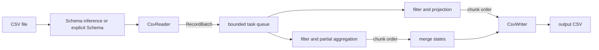

# Architecture

## Data flow and responsibilities

`DataType`, `Field`, `Schema`, and `Value` form the typed model. `Value` is
`variant<monostate, int64_t, double, string, bool>`; `monostate` is null. A `RecordBatch` owns its
rows and is moved into one task, making worker ownership unambiguous.

`CsvReader` owns an `ifstream`, parser position, physical-line count, and logical data-row count.
It implements stateful character-level parsing so quoted fields may span physical lines. It turns
raw text into typed values at the reader boundary. `CsvWriter` owns its `ofstream` and schema and
quotes fields on output.

`PipelineConfig` is a value object describing input typing, operations, chunk size, threads, and
CSV dialect. Preparation resolves names to indexes and parses a filter literal exactly once. The
`Pipeline` then coordinates reading, task submission, ordered consumption, merging, and writing.

## Ownership and lifetimes

Streams, workers, futures, rows, and state use direct RAII ownership. There are no owning raw
pointers or process-wide mutable objects. A `ThreadPool` owns every joinable worker. Tasks are held
as move-aware packaged work behind `shared_ptr` only because `std::function` requires a copyable
callable; the task/future pair is otherwise single-operation ownership.

The prepared plan and pipeline config outlive every submitted task because all futures are consumed
inside `Pipeline::run`. Batches are captured by move. A deque limits pending futures to twice the
worker count, so projection output does not accumulate an entire input file.

## Chunking and concurrency

Reading remains single-threaded because one parser owns one sequential stream. Each complete batch
is independent after typed conversion. Workers filter rows and either return projected rows or a
map of partial aggregation states. The coordinator consumes futures in submission order, so output
rows retain source order and worker scheduling cannot change merge order.

The pool protects its FIFO work queue and stop flag with one mutex. A condition variable wakes
workers on submission or shutdown. Shutdown marks the pool closed, wakes all workers, drains queued
work, and joins every thread. Exceptions captured by `packaged_task` are rethrown by `future::get`
in the coordinator; none are silently swallowed.

## Aggregation merging

Each group has one state per requested aggregation. `count` tracks rows or non-null inputs. `sum`
and `mean` track count plus sum; `min` and `max` track optional extrema. Chunk states merge using
associative state operations, and mean is finalized only after the global sum and count are known.
Group results use an ordered map keyed by the typed group value, which makes output ordering stable.
Null is a valid group key. Numeric outputs are doubles except count, which is `int64_t`.

Floating addition is not mathematically associative. Determinism here means a fixed input chunking
and fixed merge order produce the same result for one or many worker threads. Changing chunk size
can change the last few bits; compensated summation would be a useful numeric extension.

## Errors and exception safety

Invalid data and file operations throw `DataError` with contextual text. Conversion diagnostics
contain logical data row, column name, expected type, and offending value. Configuration is fully
validated before worker submission or row output. Futures carry worker exceptions back to the
calling thread.

RAII closes files and joins threads during stack unwinding. Parsed batches and partial states are
constructed off to the side and moved into containers, giving their operations the normal strong
guarantee of the standard containers. Output itself has the basic guarantee: a failure can leave a
partial output file, which is documented rather than hidden.

## Interfaces and trade-offs

The architecture favors composition and concrete value types over a hierarchy of one-method
interfaces. At the current scope, `CsvReader`, `CsvWriter`, and the prepared operations have no
second substitutable implementation, so virtual bases would add lifetime and allocation overhead
without useful polymorphism.

The current extension points are:

- Add a `DataType` alternative with parsing, formatting, comparison, and binding support.
- Add an aggregation by defining its partial state, merge rule, final type, parser name, and tests.
- Add a reader or writer behind a small batch-oriented concept once a real second format exists.
- Replace the simple `Filter` with an expression tree while retaining the prepared-index stage.
- Add an execution policy around batch submission without changing the parser or typed model.

Schema inference uses a bounded sample and then reopens the file. This avoids buffering sampled rows
and keeps execution simple, at the cost of requiring a seekable path and reading the sample twice.
Grouped aggregation necessarily retains one state per distinct key; projection remains bounded by
chunk size and the in-flight window.
