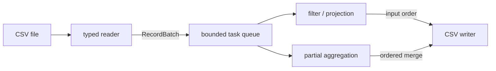

# DataPipe

[](https://github.com/MadniAbdulWahab/cpp-data-processing-engine/actions/workflows/ci.yml)
[](https://en.cppreference.com/w/cpp/20)
[](LICENSE)

**A typed, chunked CSV processing engine written in C++20.**

I built DataPipe around one constraint: processing a CSV file should not require holding the whole
file in memory. It reads and types rows in chunks, sends independent batches through a reusable
thread pool, and merges the results in a deterministic order.

The project is called **DataPipe**. The executable, C++ namespace, and Python module use lowercase
names: `datapipe` and `datapipe_cpp`.

[Quick example](#quick-example) · [Build](#build-and-run) · [CLI](#command-line-reference) ·
[C++ library](#using-the-c-library) · [Design](#how-the-pipeline-works) ·
[Python](#python-binding) · [Benchmarks](#tests-and-benchmarks)

## Quick example

Given a file of temperature readings:

```csv
id,region,temperature,active,note
1,north,21.5,true,"clear, calm"
2,south,18,false,"said ""cold"""
3,north,24,true,
4,east,20.5,false,cloudy
5,south,,true,missing
```

Once `datapipe` has been built, this command keeps readings above 20 °C and calculates a summary
per region:

```sh
datapipe readings.csv \
  --filter "temperature > 20" \
  --group-by region \
  --aggregate "mean:temperature,count:*" \
  --chunk-size 2 \
  --threads 4 \
  --output summary.csv
```

```csv
region,mean_temperature,count
east,20.5,1
north,22.75,2
```

Here the five input rows are split across three chunks. Grouped results are still merged in a fixed
order, and a single-threaded run produces the same output.

## What is included

- Incremental CSV parsing, including quoted fields, escaped quotes, embedded newlines, custom
  delimiters, and UTF-8 BOM handling.
- Schema inference plus explicit schemas with `int64`, `double`, `string`, `bool`, and nullable
  fields.
- Comparisons using `==`, `!=`, `<`, `<=`, `>`, and `>=`.
- Column projection and grouped `count`, `sum`, `min`, `max`, and `mean` aggregations.
- Configurable chunk sizes and worker counts with a bounded in-flight queue and stable output.
- Worker exceptions propagated back to the caller through futures.
- Optional pybind11 bindings plus dependency-free C++ tests, sanitizers, and benchmarks.

## Build and run

You need a C++20 compiler and CMake 3.20 or newer.

### Windows (Visual Studio 2022)

The checked-in CMake preset works from a regular PowerShell window:

```powershell
cmake --preset windows-msvc
cmake --build --preset windows-msvc-release
ctest --preset windows-msvc-release
```

The executable will be at `build\windows-msvc\Release\datapipe.exe`:

```powershell
.\build\windows-msvc\Release\datapipe.exe `
  .\tests\fixtures\basic.csv `
  --filter "temperature > 20" `
  --select "region,temperature" `
  --output .\results.csv
```

### Linux

```sh
cmake -S . -B build -DCMAKE_BUILD_TYPE=Release
cmake --build build --parallel
ctest --test-dir build --output-on-failure

./build/datapipe tests/fixtures/basic.csv \
  --filter "temperature > 20" \
  --select "region,temperature" \
  --output results.csv
```

## Command-line reference

```text
datapipe INPUT.csv [options] --output OUTPUT.csv

--filter EXPR          comparison such as "temperature >= 20"
--select COLUMNS       comma-separated output columns
--group-by COLUMN      group results by one column
--aggregate SPECS      for example "mean:value,count:*"
--schema FIELDS        explicit "name:type[?]" fields
--delimiter CHAR       input and output delimiter
--null-value TEXT      extra input null marker and output spelling
--chunk-size N         rows per chunk (default: 50000)
--threads N            worker threads (default: 1)
--output PATH          output CSV path
```

Type inference samples the first 1,000 data rows. For stricter validation—or to skip the sampling
pass—provide the schema yourself:

```sh
datapipe readings.csv \
  --schema "id:int,region:string,temperature:double?,active:bool,note:string?" \
  --output typed.csv
```

The `?` suffix makes a field nullable. Conversion errors include the row, column, expected type,
and offending value, which makes bad input reasonably quick to track down.

Exit codes are stable: `0` for success, `2` for invalid command-line arguments, `3` for data or
filesystem errors, and `4` for unexpected failures.

## Using the C++ library

The CLI and Python module both call the same `datapipe::core` library. Until install and package
export rules are added, another CMake project can include it directly:

```cmake
add_subdirectory(path/to/cpp-data-processing-engine)
target_link_libraries(my_app PRIVATE datapipe::core)
```

The public entry point takes paths and a value-type configuration:

```cpp
#include <datapipe/pipeline.hpp>
#include <utility>

datapipe::PipelineConfig config;
config.filter = datapipe::parse_filter("temperature > 20");
config.select = {"region", "temperature"};
config.chunk_size = 50'000;
config.threads = 4;

const auto result =
    datapipe::process_csv("readings.csv", "warm-readings.csv", std::move(config));
```

## How the pipeline works



CSV parsing stays on one thread because it owns a sequential stream. Once a batch is parsed and
typed, it is moved to a worker. At most twice the worker count is kept in flight, so filtering and
projection do not quietly accumulate the complete input in memory.

Completed futures are consumed in submission order. That preserves source order for filtered and
projected rows and gives partial aggregation states a deterministic merge order. `mean`, for
example, carries a sum and count across chunks and performs division only after the final merge.

Streams own their files, batches own their rows, and the thread pool owns and joins its workers.
There are no detached threads or owning raw pointers.

For a closer look at ownership, error propagation, and aggregation state, see
[ARCHITECTURE.md](ARCHITECTURE.md).

## CSV behavior

The first record is the header. Names must be non-empty and unique; when an explicit schema is
provided, its names and order must match the header.

Whitespace is kept as data. Empty fields and a configurable marker can represent null. Malformed
input—such as an unterminated quote, text after a closing quote, or the wrong number of fields—is
reported instead of being silently repaired.

A header-only file is a valid empty dataset. A zero-byte file requires an explicit schema because
there is no header from which to infer the columns.

## Python binding

Python support is optional; the core library and CLI do not depend on pybind11.

```sh
python -m pip install pybind11
cmake -S . -B build-python \
  -DCMAKE_BUILD_TYPE=Release \
  -DDATAPIPE_BUILD_PYTHON=ON
cmake --build build-python --parallel
ctest --test-dir build-python --output-on-failure
```

```python
from datapipe_cpp import PipelineConfig, parse_aggregations, parse_filter, process_csv

config = PipelineConfig()
config.filter = parse_filter("temperature > 20")
config.group_by = "region"
config.aggregations = parse_aggregations("mean:temperature,count:*")
config.threads = 4

result = process_csv("readings.csv", "summary.csv", config)
print(f"read {result.input_rows} rows and wrote {result.output_rows}")
```

See [examples/python_example.py](examples/python_example.py) for the complete example.

## Tests and benchmarks

The test suite covers parsing edge cases, type conversion, every filter and aggregation, chunk
boundaries, error propagation, CLI behavior, and equivalence between single- and multi-threaded
runs. GitHub Actions builds with GCC and Clang and runs AddressSanitizer and
UndefinedBehaviorSanitizer separately.

To run the end-to-end benchmark on generated data:

```sh
python tools/generate_dataset.py benchmark.csv --rows 1000000
cmake -S . -B build-release -DCMAKE_BUILD_TYPE=Release
cmake --build build-release --parallel
./build-release/datapipe_benchmark benchmark.csv 3
```

The benchmark is end to end: schema inference, parsing, processing, output, and flush are all
timed. In one recorded 100,000-row Windows run, grouped aggregation with 1,000-row chunks produced
these raw durations:

| Threads | Run 1 | Run 2 |
|---:|---:|---:|
| 1 | 341 ms | 317 ms |
| 12 | 244 ms | 216 ms |

This is a local engineering observation, not a general throughput claim. The complete results,
machine details, and measurement limitations are in [BENCHMARKS.md](BENCHMARKS.md).

## Project layout

```text
include/datapipe/   public C++ headers
src/                parser and pipeline implementation
app/                command-line application
tests/              unit and integration tests
benchmarks/         benchmark executable
tools/              deterministic dataset generator
python/             pybind11 module
examples/           Python example
```

## Current scope

The query model is deliberately small. Filters contain one comparison, grouping uses one column,
and grouped aggregation keeps state for every distinct key—so its memory use grows with group
cardinality. There is no join, sort, stdin reader, automatic delimiter detection, or compound
boolean expression yet. Output is written directly, so an I/O failure can leave a partial file.

These are the next areas worth extending; the batch boundary itself does not need to change to
support them.

## Contributing

Build instructions, formatting rules, sanitizer configuration, and the pull-request checklist are
in [CONTRIBUTING.md](CONTRIBUTING.md).

## License

Released under the [MIT License](LICENSE).
