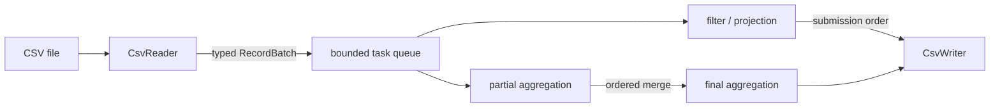

# datapipe

`datapipe` is a C++20 command-line engine for processing CSV data in bounded chunks. It reads a
typed stream of records, applies filters and projections, computes grouped aggregations, and writes
deterministic CSV output. The same engine is also available through an optional Python module.

I built the project around a simple constraint: processing should not require loading the entire
input file into memory. That decision shaped the parser, batch model, aggregation state, thread
pool, and output ordering.

## What it does

- Reads CSV incrementally, including quoted fields, escaped quotes, embedded newlines, CRLF/LF,
  empty values, and custom delimiters.
- Infers a schema or validates data against an explicit schema.
- Represents values as `int64`, `double`, `string`, `bool`, or null.
- Filters with `==`, `!=`, `<`, `<=`, `>`, and `>=`.
- Writes only the selected columns when projection is enabled.
- Groups by one column and computes `count`, `sum`, `min`, `max`, and `mean`.
- Processes configurable chunks on a reusable thread pool.
- Preserves input order for projected rows and stable key order for grouped results.
- Propagates parser, conversion, file, and worker-thread errors to the caller.
- Refuses to overwrite the input file.

## Quick start

### Windows

The checked-in preset uses Visual Studio 2022 and works from regular PowerShell:

```powershell
cmake --preset windows-msvc
cmake --build --preset windows-msvc-release
ctest --preset windows-msvc-release
```

Run the included example:

```powershell
.\build\windows-msvc\Release\datapipe.exe `
  .\tests\fixtures\basic.csv `
  --filter "temperature > 20" `
  --select "region,temperature" `
  --group-by region `
  --aggregate "mean:temperature,count:*" `
  --chunk-size 2 `
  --threads 4 `
  --output .\results.csv
```

### Linux

```sh
cmake -S . -B build -DCMAKE_BUILD_TYPE=Release
cmake --build build --parallel
ctest --test-dir build --output-on-failure

./build/datapipe tests/fixtures/basic.csv \
  --filter "temperature > 20" \
  --select "region,temperature" \
  --group-by region \
  --aggregate "mean:temperature,count:*" \
  --chunk-size 2 \
  --threads 4 \
  --output results.csv
```

The example reads five rows in three chunks and produces:

```csv
region,mean_temperature,count
east,20.5,1
north,22.75,2
```

## Why the implementation is structured this way

CSV looks simple until parsing, typing, memory limits, and parallel execution meet. I kept those
concerns separate so each part has a clear contract:



### Typed boundary

Raw strings are converted as they leave `CsvReader`. Downstream operations work with:

```cpp
using Value = std::variant<
    std::monostate,
    std::int64_t,
    double,
    std::string,
    bool>;
```

`std::monostate` represents null. A `Schema` owns ordered `Field` definitions, and each field carries
its name, type, and nullability. Conversion failures identify the logical row, column, expected
type, and source value.

### Ownership

- `CsvReader` owns the input stream and parser state.
- `RecordBatch` owns all rows in one chunk and is moved into a worker task.
- `ThreadPool` owns every worker thread and joins them during shutdown.
- `CsvWriter` owns the output stream and output schema.
- There are no owning raw pointers or detached threads.

The task wrapper uses `std::shared_ptr<std::packaged_task<...>>` because the queue stores
`std::function<void()>`, which requires a copyable callable. The work itself still has one logical
owner and one associated future.

### Chunking and concurrency

One thread reads the sequential CSV stream. Completed batches can then be processed independently.
The pipeline keeps at most twice the worker count in flight, which prevents a fast reader from
building an unbounded queue.

Futures are consumed in submission order. This gives two useful guarantees:

1. Filtered or projected rows keep their original input order.
2. Partial aggregation states merge in a fixed order, independent of worker scheduling.

Each aggregation has mergeable state. For example, `mean` stores a partial sum and count; division
happens only after all chunks have been merged. A one-thread run and a multi-thread run therefore
follow the same chunk merge order.

More detail is available in [ARCHITECTURE.md](ARCHITECTURE.md).

## CLI reference

```text
datapipe INPUT.csv [options] --output OUTPUT.csv

--filter EXPR          comparison such as "temperature >= 20"
--select COLUMNS       comma-separated output columns
--group-by COLUMN      one grouping column
--aggregate SPECS      for example mean:value,count:*
--schema FIELDS        explicit name:type[?] fields
--delimiter CHAR       input and output delimiter
--null-value TEXT      additional input null marker and output spelling
--chunk-size N         rows per chunk; default 50000
--threads N            worker threads; default 1
--output PATH          output CSV path
```

Exit codes are stable: `0` for success, `2` for command-line errors, `3` for data or filesystem
errors, and `4` for unexpected failures.

### Explicit schemas

By default, `datapipe` infers types from the first 1,000 data rows and then reopens the file for the
real processing pass. An explicit schema avoids sampling and gives stricter validation:

```sh
datapipe input.csv \
  --schema "id:int,region:string,temperature:double?,active:bool" \
  --output typed.csv
```

The `?` suffix marks a nullable field. Supported type names are `int`, `double`, `string`, and
`bool`.

## CSV rules

The first record is treated as the header. Column names must be non-empty and unique. With an
explicit schema, header names and order must match the schema.

Supported input behavior:

- quoted fields and doubled quote escaping (`""`);
- delimiters and line breaks inside quoted fields;
- LF and CRLF record endings;
- a UTF-8 BOM on the first header field;
- a final record without a newline;
- empty fields and a configurable null marker;
- a configurable single-character delimiter.

Whitespace is preserved as data. A quote inside an unquoted field, text after a closing quote, an
unterminated quote, or the wrong field count is reported as malformed input.

A header-only file is a valid empty dataset. A zero-byte file is accepted only when an explicit
schema supplies the missing column contract.

## Tests and verification

The tests use a small dependency-free C++ harness and CTest. Coverage includes:

- schema construction and every supported value type;
- invalid conversions and nullability failures;
- quoted, escaped, multiline, malformed, and custom-delimiter CSV;
- all six comparison operators;
- projection and all five aggregations;
- grouping and partial-state merging across chunks;
- empty, header-only, single-row, and final-partial-chunk inputs;
- thread-pool shutdown and worker exception propagation;
- one-thread versus multi-thread output equivalence;
- CLI success, validation failure, help, and input overwrite protection;
- the Python binding when enabled.

Local verification completed for this revision:

| Configuration | Result |
|---|---:|
| MSVC 19.44, Debug | 5/5 CTest tests passed |
| MSVC 19.44, Release | 5/5 CTest tests passed |
| Clang 22.1.8, Debug | 5/5 CTest tests passed |
| MSVC AddressSanitizer | 5/5 CTest tests passed |
| Python 3.12 + pybind11 3.0.4 | 6/6 CTest tests passed |

The GitHub Actions workflow builds and tests with GCC and Clang on Ubuntu. A separate Clang job
runs AddressSanitizer and UndefinedBehaviorSanitizer.

## Python binding

The binding is optional; the native library and CLI do not depend on pybind11.

```sh
python -m pip install pybind11
cmake -S . -B build-python \
  -DCMAKE_BUILD_TYPE=Release \
  -DDATAPIPE_BUILD_PYTHON=ON
cmake --build build-python --parallel
ctest --test-dir build-python --output-on-failure
```

The `datapipe_cpp` module exposes `Field`, `Schema`, `Filter`, `Aggregation`, `PipelineConfig`,
`ProcessingResult`, and `process_csv`. The binding releases the GIL while C++ processes the file.
See [examples/python_example.py](examples/python_example.py) for a complete call.

## Benchmarking

The repository includes a deterministic dataset generator and an end-to-end benchmark executable:

```sh
python tools/generate_dataset.py benchmark.csv --rows 1000000
cmake -S . -B build-release -DCMAKE_BUILD_TYPE=Release
cmake --build build-release --parallel
./build-release/datapipe_benchmark benchmark.csv 3 > benchmark-results.csv
```

The timed section includes schema inference, parsing, processing, output, and flush. It covers
filtering, filtering with projection, grouped aggregation, two chunk sizes, and one versus all
available hardware threads.

I kept the raw results from one 100,000-row Windows run in [BENCHMARKS.md](BENCHMARKS.md), together
with the machine details and measurement limitations. The main result was practical rather than
headline-worthy: small chunks benefited from multiple workers, while two 50,000-row chunks could
not keep twelve workers busy.

## Repository layout

```text
include/datapipe/   public C++ headers
src/                core implementation
app/                command-line entry point
tests/              unit/integration tests and fixtures
benchmarks/         benchmark executable
tools/              deterministic dataset generator
python/             pybind11 module
examples/           Python usage example
.github/workflows/  Linux CI
```

## Current limits

- Filters contain one comparison; there is no boolean expression tree yet.
- Grouping supports one column.
- Schema inference requires a seekable file because the sample is read twice.
- Grouped aggregation memory grows with the number of distinct keys.
- Floating-point sums use ordinary addition rather than compensated summation.
- Output is written directly, so an I/O failure can leave a partial output file.
- There is no stdin reader, join, sort, or automatic delimiter detection.

The next changes I would make are compound filter expressions, multiple grouping keys, compensated
sums, and atomic output replacement.

## License

This project is available under the [MIT License](LICENSE).
